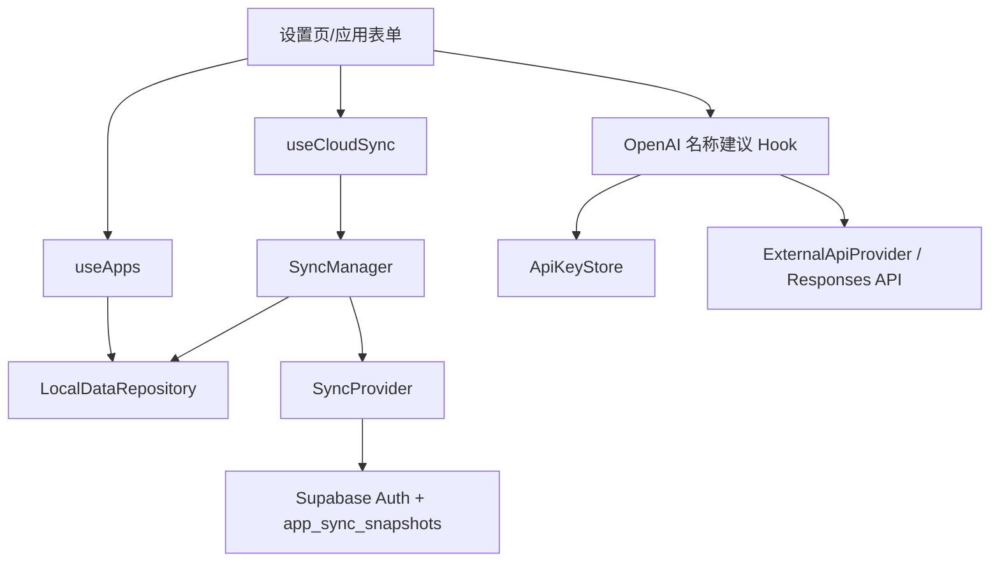

# 完成 Personal Web Seed Phase 2–4 设计

## 1. 背景与目标

本设计在 Phase 1 的 `LocalAppEnvelope` 和 Repository 之上完成可选云同步与 BYOK。云和第三方 API 都是可拔插增强：失败时只影响对应增强功能，正式本地数据继续保存。

## 2. 总体架构



Supabase SDK 只在云同步已启用且配置完整时通过动态 import 加载。OpenAI 通过浏览器 `fetch` 直连，Key 来自用户浏览器。

## 3. 同步状态机

```text
disabled / misconfigured / signed-out
                  ↓ 登录
idle → checking → pulling / pushing → synced
          ├─ offline → waiting-online
          ├─ version mismatch → conflict
          └─ request failure → error（本地 dirty 保留）
```

决策矩阵：

1. 远程不存在：上传本地，远程版本至少为本地版本。
2. 本地为初始空数据、远程存在：备份后应用远程。
3. 本地未修改且远程版本高于 lastRemoteVersion：应用远程。
4. 本地已修改且远程版本等于 lastRemoteVersion：安全上传。
5. 本地已修改且远程版本高于 lastRemoteVersion：进入冲突。
6. 远程版本低于已知 lastRemoteVersion：作为异常冲突处理，不自动覆盖。

上传更新必须过滤 `user_id`、`app_id` 和 `data_version = expectedRemoteVersion`。返回零行代表并发失败，Provider 抛出 `REMOTE_VERSION_MISMATCH`，Manager 重新 pull 后进入冲突。

## 4. 冲突处理

- **保留本地**：先在浏览器备份当前云端，再以冲突远程版本为 expectedRemoteVersion 强制更新；远程新版本取 `max(local.dataVersion, remote.dataVersion + 1)`。
- **使用云端**：先备份当前本地，再通过同一 Schema 迁移和 Zod 校验应用远程。
- **分别导出**：下载两份标准导出 JSON，不修改任一侧。
- **取消**：保留 conflict 状态，不启用自动上传。

## 5. 认证与安全

- 使用 Supabase `signInWithOtp` 邮箱 Magic Link 和 `onAuthStateChange`。
- `user_id` 只取 Auth Session；Provider 查询仍显式过滤 user_id/app_id，RLS 作为最终边界。
- 浏览器只使用 publishable key；配置不完整时 UI 说明，不尝试连接。
- Auth Token 由 Supabase SDK 管理，不创建自定义副本，不进入 PWA 运行时缓存。

## 6. BYOK Provider

OpenAI Provider 调用 `POST /v1/responses`，发送 model、instructions、input 和 max_output_tokens；对原始 JSON 使用 Zod 校验。默认模型可由公开环境变量覆盖。Provider 包含 20 秒超时、AbortSignal、一次有限重试、HTTP 错误归一化和离线/CORS 提示。

Key 默认 sessionStorage；勾选记住才写 LocalStorage。名称建议只回填表单，不自动写业务数据。功能不可用时用户仍可手动输入名称。

## 7. 自动同步

- 默认关闭，偏好使用独立 Zod Store 保存，不进入业务 Payload或云快照。
- 开启后仅在在线、已登录、本地 dirty、无冲突时，变更稳定 3 秒后上传。
- 登录后启动执行一次版本检查；`online` 事件只触发提示和可选同步。
- 失败保留 dirty 和重试入口，不阻塞本地业务更新。

## 8. 风险与权衡

- **无真实 Supabase 环境**：使用网关单元测试和双设备内存 Provider 集成测试覆盖算法；START 要求部署前再做真实 RLS 隔离验证。
- **浏览器直连 OpenAI CORS 或组织策略变化**：Provider 显示明确错误；后续可替换为 Server Provider，业务组件不变。
- **模型名称变化**：默认值集中在公开配置，可通过 `VITE_OPENAI_MODEL` 更新。
- **本地/远程版本不连续**：远程强制覆盖使用单调递增版本，Repository 同步确认不会降低本地版本。
- **自动同步误覆盖**：冲突状态禁止自动上传，所有覆盖动作需要确认。

## 9. 验收标准

- 云关闭或配置缺失时，本地功能、构建和测试不受影响。
- Magic Link、会话监听、手动/自动同步和全部云操作有可执行 UI。
- 决策矩阵、乐观并发、冲突四处理和双设备流程有测试。
- OpenAI Key 存储、请求结构、超时、错误和响应校验有测试。
- START 覆盖从安装到派生开发、OpenSpec 和部署的完整路径。
- OpenSpec 严格校验以及 typecheck、lint、test、build 全部通过。
