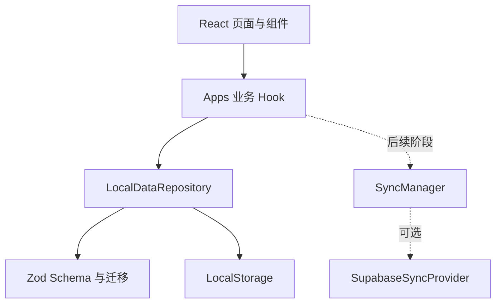

# Personal Web Seed 本地优先基础设计

## 1. 背景与目标

本变更将 Gipsy 从单一用途的小型前端升级为 Personal Web Seed 的首个参考实现。Gipsy 业务继续负责管理外部应用入口并执行浏览器级跳转；通用基础设施负责数据持久化、校验、迁移、恢复、错误、PWA 和工程质量。

核心验收条件是：无网络、未登录、未配置 Supabase 时，用户仍能查看、添加、删除和启动本地配置的应用。

## 2. 现状分析

- `useApps` 直接围绕数组管理状态，`storage.ts` 直接读写 `gipsy-apps`。
- 读取仅做弱过滤，写入未捕获序列化错误和配额错误。
- 数据没有 schemaVersion、dataVersion、deviceId 和 dirty 状态。
- 没有导入、导出、容量提示、迁移与恢复能力。
- UI、路由与基础设施集中在少量文件中，缺少 Feature 边界。
- TypeScript 已启用 strict，PWA 构建可用，但没有测试、Lint、格式化和 CI。

## 3. 设计方案

### 3.1 分层架构



- `app`：应用装配、Router 和全局 Provider。
- `features/apps`：Gipsy 应用入口业务的类型、Schema、Hook 和 Repository 配置。
- `lib/local-data`：与具体业务无关的 Envelope、迁移、导入导出和容量计算。
- `lib/api-keys`：可复用的 session/persistent Key Store，不进入业务快照。
- `lib/errors`：统一错误码与面向用户的错误归一化。

### 3.2 数据模型

```ts
interface LocalAppEnvelope<TPayload> {
  appId: string;
  schemaVersion: number;
  dataVersion: number;
  updatedAt: string;
  deviceId: string;
  payload: TPayload;
  sync: {
    dirty: boolean;
    lastRemoteVersion: number | null;
    lastSyncedAt: string | null;
  };
}
```

Gipsy 业务边界：

```ts
interface GipsyPayload {
  apps: Array<{ id: string; name: string; url: string }>;
}
```

Envelope 的版本、时间、设备和同步字段不得进入业务组件；业务 Payload 不保存 API Key、认证状态或设备偏好。

### 3.3 本地读写流程

```text
读取 JSON
→ 校验 Envelope 基础结构
→ 检查 appId 与 schemaVersion
→ 必要时备份并顺序迁移
→ 使用业务 Payload Schema 校验
→ 返回强类型数据
```

每次业务更新：校验新 Payload，`dataVersion + 1`，更新时间，设置 `dirty = true`，再写入 LocalStorage。任何失败都抛出统一 `AppError`，由界面展示可理解提示。

### 3.4 旧数据迁移

当 `app:gipsy:data` 不存在时检查旧键 `gipsy-apps`：

1. JSON 解析并通过旧应用数组 Schema 校验；
2. 为每个应用生成 UUID；
3. 构造 schemaVersion 1 的 Envelope；
4. 写入新存储键；
5. 将旧 JSON 写入 `app:gipsy:data:legacy-backup`；
6. 删除旧键。

任何一步失败都不得删除旧键。

### 3.5 导入导出

导出只包含格式标识、appId、两个版本、导出时间和 Payload，不包含 deviceId、同步状态、API Key 或认证信息。

导入顺序为格式校验、appId 校验、Schema 迁移、Payload 校验、用户确认、当前数据备份、覆盖保存。导入视为新的本地修改，因此新 dataVersion 大于当前和导入文件中的版本，并保持 dirty。

### 3.6 PWA 与离线

- Service Worker 只预缓存应用壳和构建静态资源。
- 不添加跨域 API、认证响应或用户 Key 的运行时缓存。
- 离线时继续允许本地增删、导入和导出；顶部显示离线状态。
- 新版本 Service Worker 继续由用户点击刷新应用。

### 3.7 Codex 辅助开发约束

- 所有变更先维护 OpenSpec，再修改实现和测试。
- 每个阶段保持可运行、可测试、可部署。
- 持久化或外部数据必须经 Zod 校验；禁止 `any` 和组件直接访问存储。
- Codex 完成交付前必须运行 typecheck、lint、test、build，并核对工作区差异。
- 新业务按 `features/<name>` 组织，通用能力只有在第二个真实使用方或明确种子要求存在时才抽取。

## 4. 关键接口与状态

`LocalDataRepository<TPayload>` 提供 `load`、`save`、`update`、`reset`、`exportJson`、`importJson`、`getStorageSize` 和最近备份读取能力。实现允许注入 Storage、时间和 ID 生成器，以便单元测试。

容量分级：小于 2 MB 为正常，2～4 MB 为提醒，大于 4 MB 为严重提醒并建议导出或升级 IndexedDB。

统一错误至少覆盖数据校验、迁移、序列化、LocalStorage 配额和未知错误；错误上下文不得包含 API Key 或完整私密 Payload。

## 5. 风险与权衡

- **旧数据不合法**：保留旧键并显示错误，允许用户在清空前自行备份。
- **LocalStorage 配额不足**：抛出专用错误并提示导出；不自动删除用户数据。
- **全量序列化性能**：当前数据规模很小；达到容量阈值后提示 IndexedDB，而不是本阶段提前引入。
- **导入覆盖错误**：UI 二次确认，Repository 自动保存最近备份。
- **Tailwind 改造产生视觉偏差**：保留现有类名和布局语义，通过 Tailwind `@apply` 迁移。
- **云同步接口过度设计**：本阶段只保留 Envelope 同步字段和目录边界，不实现未被使用的运行时同步抽象。

## 6. 里程碑与验收标准

1. OpenSpec、目录和工具链完成，四条验证命令可运行。
2. Repository、迁移、导入导出、容量和 Key Store 均有单元测试。
3. 首页和设置页完全通过 Repository 工作，现有跳转协议保持不变。
4. 离线状态、存储错误、导入确认和清空确认具有明确反馈。
5. README、CI、Vercel、PWA 和 `AGENTS.md` 可指导后续 Codex 派生项目。
6. `npm run typecheck`、`npm run lint`、`npm run test -- --run`、`npm run build` 全部通过。
