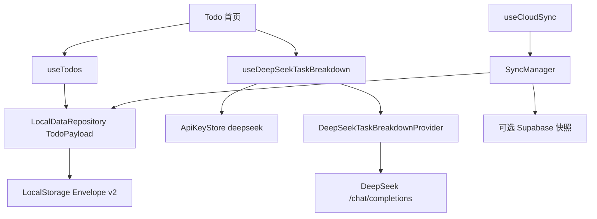

# Todo + DeepSeek 参考业务设计

## 1. 背景与目标

参考业务应尽量接近个人 Web 工具的共同形态，并让后续 Agent 能看到完整的数据建模、迁移、交互和外部 Provider 示例。Todo 比导航门户更适合作为默认起点，同时不会改变 Local-first 与可选云同步基础设施。

## 2. 总体架构



## 3. Todo 数据模型

```ts
interface TodoItem {
  id: string;
  title: string;
  notes: string;
  completed: boolean;
  createdAt: string;
  updatedAt: string;
  completedAt: string | null;
}

interface TodoPayload {
  todos: TodoItem[];
}
```

标题长度为 1～120，用户新建时备注最多 500 字符，ID 唯一，时间为 ISO datetime。持久化 Schema 允许保留旧导航迁移来的完整名称与 URL；新增、切换完成、删除和清理已完成都通过 Repository 原子更新，从而统一递增 dataVersion 和设置 dirty。

## 4. Schema 迁移

当前 schemaVersion 1 的结构为 `{ apps: [{ id, name, url }] }`。迁移到版本 2 时：

1. Repository 自动保存原 Envelope 备份。
2. 校验旧 apps 数组。
3. 复用旧 ID；标题设为 `迁移的应用：<name>`，超出标题上限时只缩短标题展示。
4. 备注保存完整旧名称和 `旧入口：<url>`，原始信息不丢失。
5. completed 为 false，时间使用迁移时刻。
6. 通过 TodoPayload Schema 后写回版本 2，并标记 dirty。

旧 `gipsy-apps` 裸数组由 legacy parser 直接转换为相同 Todo 结构，成功后保留 legacy backup。

## 5. Todo 交互

- 首页表单新增标题和可选备注。
- 列表支持全部、待完成、已完成三种过滤。
- checkbox 切换完成状态并维护 completedAt。
- 删除单条任务需要确认；清理全部已完成任务也需要确认。
- 空列表和过滤后为空分别显示明确状态。
- 设置页继续承载数据、云同步、PWA 和 DeepSeek Key。

## 6. DeepSeek Provider

Provider 调用 `POST https://api.deepseek.com/chat/completions`，默认模型为 `deepseek-v4-flash`。请求使用 system/user messages、`response_format: { type: "json_object" }`、合理 max_tokens 和非流式返回；提示词明确要求 JSON 及 `{ "subtasks": string[] }` 示例。

响应流程：

```text
HTTP 响应
→ Zod 校验 Chat Completion 外层
→ 读取 choices[0].message.content
→ JSON.parse
→ Zod 校验 2～6 个唯一子任务
→ 返回业务 Hook
```

Provider 延续 20 秒超时、AbortSignal、429/5xx 一次重试和统一 AppError。浏览器直连被 CORS 阻止时显示 `API_CORS_BLOCKED`，Todo 手工操作继续可用。

## 7. Key 与配置

- Provider ID 固定为 `deepseek`。
- 默认 Key 保存到 sessionStorage；显式“记住”才保存到 LocalStorage。
- 环境变量改为 `VITE_DEEPSEEK_MODEL`，默认 `deepseek-v4-flash`。
- Key 不进入 TodoPayload、导出、Supabase、URL、日志或 PWA 缓存。

## 8. 风险与权衡

- **旧导航用途消失**：这是用户明确要求；迁移待办保留原名称和 URL，且覆盖前有原 Envelope 备份。
- **DeepSeek 模型名称变化**：模型集中在公开环境配置，更新时只改配置和 Provider 测试。
- **JSON Output 偶发空内容**：Provider 将其视为 INVALID_RESPONSE，不自动写 Todo，用户可重试或手工拆解。
- **CORS 限制**：保持 Server Provider 替换边界，不把 Key 硬编码进前端。
- **Todo 功能膨胀**：只实现常见 CRUD/过滤，提醒、排序和协作必须独立 OpenSpec。

## 9. 验收标准

- 首屏不再出现应用导航、appName 或 URL 添加入口。
- 用户可新增、完成、筛选、删除和清理 Todo，刷新后恢复。
- schemaVersion 1 和旧裸数组均能保留信息迁移到 Todo。
- DeepSeek Key 设置、清除和任务拆解可操作，仓库无 OpenAI 运行时代码或文案。
- 云同步继续以 TodoPayload 工作，离线和未配置云时本地功能完整。
- README、START、AGENTS 与 OpenSpec 指向 Todo + DeepSeek。
- 类型、Lint、测试、格式、构建、PWA、严格规范和浏览器交互回归通过。
